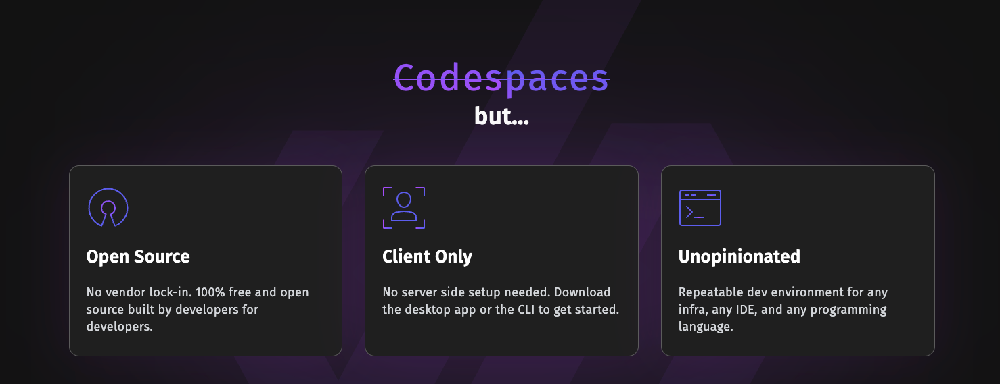

 
<a href="https://www.dev.khulnasoft.com">
  <picture width="500">
    <source media="(prefers-color-scheme: dark)" srcset="docs/static/media/devspace_dark.png">
    
  </picture>
</a>

### **[Website](https://www.dev.khulnasoft.com)** • **[Quickstart](https://www.dev.khulnasoft.com/docs/getting-started/install)** • **[Documentation](https://www.dev.khulnasoft.com/docs/what-is-devspace)** • **[Blog](https://loft.sh/blog)** • **[𝕏 (Twitter)](https://x.com/loft_sh)** • **[Slack](https://slack.loft.sh/)**

 

**[We are hiring!](https://www.loft.sh/careers) Come build the future of remote development environments with us.**

DevSpace is a client-only tool to create reproducible developer environments based on a [devcontainer.json](https://containers.dev/) on any backend. Each developer environment runs in a container and is specified through a [devcontainer.json](https://containers.dev/). Through DevSpace providers, these environments can be created on any backend, such as the local computer, a Kubernetes cluster, any reachable remote machine, or in a VM in the cloud.

You can think of DevSpace as the glue that connects your local IDE to a machine where you want to develop. So depending on the requirements of your project, you can either create a workspace locally on the computer, on a beefy cloud machine with many GPUs, or a spare remote computer. Within DevSpace, every workspace is managed the same way, which also makes it easy to switch between workspaces that might be hosted somewhere else.

## Quickstart

Download DevSpace Desktop:
- [MacOS Silicon/ARM](https://dev.khulnasoft.com/releases/latest/download/DevSpace_macos_aarch64.dmg)
- [MacOS Intel/AMD](https://dev.khulnasoft.com/releases/latest/download/DevSpace_macos_x64.dmg)
- [Windows](https://dev.khulnasoft.com/releases/latest/download/DevSpace_windows_x64_en-US.msi)
- [Linux AppImage](https://dev.khulnasoft.com/releases/latest/download/DevSpace_linux_amd64.AppImage)

Take a look at the [DevSpace Docs](https://dev.khulnasoft.com/docs/getting-started/install) for more information.

## Why DevSpace?

DevSpace reuses the open [DevContainer standard](https://containers.dev/) (used by GitHub Codespaces and VSCode DevContainers) to create a consistent developer experience no matter what backend you want to use.

Compared to hosted services such as Github Codespaces, JetBrains Spaces, or Google Cloud Workstations, DevSpace has the following advantages:
* **Cost savings**: DevSpace is usually around 5-10 times cheaper than existing services with comparable feature sets because it uses bare virtual machines in any cloud and shuts down unused virtual machines automatically.
* **No vendor lock-in**: Choose whatever cloud provider suits you best, be it the cheapest one or the most powerful, DevSpace supports all cloud providers. If you are tired of using a provider, change it with a single command.
* **Local development**: You get the same developer experience also locally, so you don't need to rely on a cloud provider at all.
* **Cross IDE support**: VSCode and the full JetBrains suite is supported, all others can be connected through simple ssh.
* **Client-only**: No need to install a server backend, DevSpace runs only on your computer.
* **Open-Source**: DevSpace is 100% open-source and extensible. A provider doesn't exist? Just create your own.
* **Rich feature set**: DevSpace already supports prebuilds, auto inactivity shutdown, git & docker credentials sync, and many more features to come.
* **Desktop App**: DevSpace comes with an easy-to-use desktop application that abstracts all the complexity away. If you want to build your own integration, DevSpace offers a feature-rich CLI as well.
